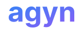
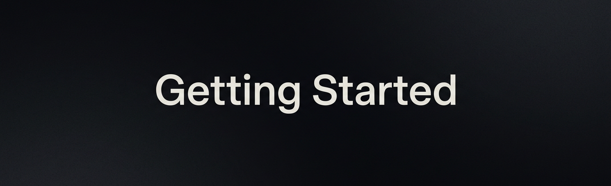

<p align="center">
  
</p>

<p align="center">
  <a href="https://www.gnu.org/licenses/agpl-3.0"></a>
  <a href="https://github.com/agynio/platform/stargazers"></a>
  <a href="https://discord.com/invite/eQKYwnNqRX"></a>
</p>


You built the agent. Now how do you let the rest of the company use it — without exposing secrets, blowing budgets, or losing control? Agyn is an open-source, Kubernetes-native agent orchestration platform. Run any AI agent (Claude Code, Codex, custom) at scale with serverless execution, Terraform-managed configuration, and zero-trust networking where credentials never reach the LLM context.

## Why Agyn

| Problem | Agyn |
|---------|------|
| Agents run on individual laptops | Centralized deployment on your infrastructure |
| Secrets passed directly to models | Secrets isolated, never exposed to the model |
| No budget visibility or limits | Spend caps at any level — per agent, per team, per org |
| No access control | RBAC, SSO, audit logs |
| Locked to one vendor | Agent-agnostic, model-agnostic |
| Can't scale | Horizontal scaling, auto-termination on idle |

## How Agyn Compares

An **open-source, self-hosted alternative** to Google AX, AWS Bedrock AgentCore, and Claude Code Cloud for running AI agents in production with full control over security and configuration.

| Capability | Agyn | Google AX | AWS AgentCore | Claude Code Cloud | kagent | Copilot Studio |
|:---|:---:|:---:|:---:|:---:|:---:|:---:|
| Self-hostable | ${\color{green}✓}$ | ${\color{green}✓}$ | ${\color{red}✗}$ | ${\color{red}✗}$ | ${\color{green}✓}$ | ${\color{red}✗}$ |
| Run any agent container | ${\color{green}✓}$ | ${\color{red}✗}$ | ${\color{green}✓}$ | ${\color{red}✗}$ | ${\color{red}✗}$ | ${\color{red}✗}$ |
| Declarative config (IaC) | ${\color{green}✓}$ (Terraform) | ${\color{green}✓}$ (YAML) | ${\color{red}✗}$ | ${\color{red}✗}$ | ${\color{green}✓}$ (CRDs) | ${\color{red}✗}$ |
| Serverless (scale-to-zero) | ${\color{green}✓}$ | ${\color{green}✓}$ | ${\color{green}✓}$ | ${\color{green}✓}$ | ${\color{red}✗}$ | ${\color{green}✓}$ |
| MCP servers isolation | ${\color{green}✓}$ | ${\color{red}✗}$ | -- | -- | ${\color{red}✗}$ | -- |
| Secrets never reach LLM | ${\color{green}✓}$ | ${\color{red}✗}$ | -- | -- | ${\color{red}✗}$ | -- |
| Zero-trust networking | ${\color{green}✓}$ | ${\color{red}✗}$ | ${\color{red}✗}$ | ${\color{red}✗}$ | ${\color{red}✗}$ | ${\color{red}✗}$ |
| Per-conversation sandboxing | ${\color{green}✓}$ | ${\color{green}✓}$ | ${\color{green}✓}$ | ${\color{green}✓}$ | ${\color{red}✗}$ | ${\color{green}✓}$ |

### Coming from...

- **Google AX?** — AX sandboxes conversations but not tools from the agent; Agyn isolates each MCP server in its own container and runs any agent without protocol adaptation. Comes with pre-built Claude Code and Codex agents out of the box.
- **AWS AgentCore?** — Agyn gives you the same serverless execution, self-hosted, with Terraform config and zero-trust access to internal services.
- **Claude Code Cloud?** — Agyn runs Claude Code as one of many agent containers on your own infrastructure with per-tool credential isolation.
- **kagent?** — Agyn adds serverless scale-to-zero, agent-agnostic containers, and security isolation beyond Kubernetes RBAC.

## Getting Started



### On your laptop

The whole platform — control plane, overlay, database, object storage, and a runner — in a VM on your machine. One command, nothing to wire together.

```bash
brew install agynio/tap/agyn
agyn local start
```

The first run downloads the platform image, so give it a few minutes. It asks once whether to trust the VM's CA, then ends with a link to the console. By then you have a running platform, a profile pointing at it, and a CLI already authenticated against it.

See [Local installation](./docs/local-install/README.md) for prerequisites, flags, and lifecycle commands.

### On your cluster

Production is one Helm release from `oci://ghcr.io/agynio/charts`. The chart deploys the control plane, the workload layer, and the provisioning controller that reconciles the resources the release declares — there is no operator step in the middle.

```bash
helm upgrade --install agyn-platform oci://ghcr.io/agynio/charts/agyn-platform \
  --namespace platform --create-namespace \
  -f values-platform.yaml
```

Name your cluster administrators in the values — a release that declares none installs a platform nobody can administer. See [Production installation](./docs/production-install/README.md) for prerequisites, DNS and OIDC, optional [Kata/Firecracker workload isolation](./docs/production-install/install.md#workload-isolation-optional-recommended), and upgrades.

### Then

Open the console. Create an org. Deploy your first agent.

Want a ready-made fleet to play with? Apply [`agynio/demo-agent`](https://github.com/agynio/demo-agent) — a Terraform config that provisions a support, marketing, and data-engineer agent in one command.

## Define agents as code

Stop clicking. Version your agent infrastructure.

```hcl
resource "agyn_agent" "support" {
  organization_id = agyn_organization.acme.id

  name     = "Support"
  nickname = "support"
  role     = "assistant"

  # The environment supplies the images, compute, and volumes the agent runs with.
  environment_id = agyn_environment.support.id
  model          = agyn_model.gpt_4o.id
  image          = "ghcr.io/agynio/agent-runtime:v1.0.0"

  idle_timeout = "5m"
  availability = "internal"
}

resource "agyn_mcp" "zendesk" {
  agent_id = agyn_agent.support.id
  name     = "zendesk"
  image    = "ghcr.io/acme/zendesk-mcp:latest"
  command  = "zendesk-mcp --port 8080"
}

# The secret is delivered by reference — its value never enters the state file,
# and it is injected into the tool that needs it, not into the agent.
resource "agyn_env" "zendesk_token" {
  name      = "ZENDESK_TOKEN"
  mcp_id    = agyn_mcp.zendesk.id
  secret_id = agyn_secret.zendesk_token.id
}
```

```bash
terraform init && terraform apply
```

See the [Terraform provider](./docs/build-extend/terraform-provider.md) reference for every resource.

## How Agyn runs agents

- **Serverless runtime** — agents spawn on message, scale to zero on idle. No always-on compute.
- **Any agent container** — Claude Code, Codex, or your own. No protocol adaptation required.
- **Environments** — one definition pins the runner, compute flavor, images, volumes, and MCP servers every workload gets. Agents and sandboxes both run them.
- **MCP servers in separate containers** — each tool gets its own filesystem and process tree. Credentials are injected only into the tool that needs them, never into the agent.
- **Egress rules** — the platform attaches credentials to outbound requests at the network edge and denies destinations you have not allowed. The agent calls out with a placeholder; the real token never enters the container.
- **Zero-trust networking** — every agent gets its own x509 identity. Deny-by-default access to internal services, including private resources inside your VPC or on-prem network without a bastion.
- **Sandboxes** — an engineer launches the same runtime an agent gets, with a shell in the browser, and drives it by hand. Same image, same secrets, same egress rules.
- **Declarative config** — define agents and their harness in Terraform. Version-controlled, peer-reviewed, automated.
- **Observability** — token usage, compute, tracing, activity logs.

Full architecture: [docs/operate/architecture.md](./docs/operate/architecture.md).

## Video walkthroughs

| Video | What it shows |
|---|---|
| <a href="https://www.youtube.com/watch?v=v97sy17_w3A"></a> | **Agyn in 3 minutes** — From clean cluster to a working agent answering a chat message. End-to-end tour. |
| *Coming soon* | **Deploying agents with Terraform** — Define an agent fleet as code, apply it, talk to them. |
| *Coming soon* | **Inspecting a run with Tracing** — Every LLM call, every tool execution, every context decision. |

## Documentation

Full docs live in [`docs/`](./docs/README.md):

- [Introduction](./docs/introduction/README.md) — what Agyn is, concepts, architecture at a glance.
- [Local installation](./docs/local-install/README.md) — the whole platform in a VM on your machine.
- [Production installation](./docs/production-install/README.md) — Helm install, cluster admins, upgrades.
- [Administer](./docs/administer/README.md) — Console + Terraform for orgs, agents, models, secrets, runners, apps.
- [Use](./docs/use/README.md) — chat, files, tracing, usage, port exposure.
- [Build & extend](./docs/build-extend/README.md) — Gateway API, MCP servers, agent CLIs, apps.
- [Operate](./docs/operate/README.md) — networking, identity, scaling, backups, security.
- [Reference](./docs/reference/README.md) — glossary, service catalog, schema pointers.
- [Troubleshooting](./docs/troubleshooting/README.md) — diagnostic playbook by symptom + FAQ.

## Repository map

Agyn is split across focused repositories. The most useful starting points:

| Repo | What it is |
|---|---|
| [`agynio/platform`](https://github.com/agynio/platform) | This repo. Documentation hub. |
| [`agynio/architecture`](https://github.com/agynio/architecture) | Source-of-truth architecture and product specs. |
| [`agynio/bootstrap`](https://github.com/agynio/bootstrap) | Terraform stacks for a k3d dev cluster. For a laptop, prefer `agyn local`. |
| [`agynio/platform-charts`](https://github.com/agynio/platform-charts) | Production Helm charts. |
| [`agynio/api`](https://github.com/agynio/api) | Protobuf schemas for every service. |
| [`agynio/terraform-provider-agyn`](https://github.com/agynio/terraform-provider-agyn) | Terraform provider. |
| [`agynio/agyn-cli`](https://github.com/agynio/agyn-cli) | Platform CLI — also what `agyn local` runs the platform with. |
| [`agynio/console-app`](https://github.com/agynio/console-app) · [`chat-app`](https://github.com/agynio/chat-app) · [`tracing-app`](https://github.com/agynio/tracing-app) · [`sandboxes-app`](https://github.com/agynio/sandboxes-app) | Browser UIs. |
| [`agynio/agyn-runtime-codex`](https://github.com/agynio/agyn-runtime-codex) · [`agyn-runtime-claude`](https://github.com/agynio/agyn-runtime-claude) · [`agyn-runtime-agn`](https://github.com/agynio/agyn-runtime-agn) | Agent runtime images. |

Full list with descriptions: [docs/reference/service-catalog.md](./docs/reference/service-catalog.md).

## Community

- [Website](https://agyn.io)
- [Blog](https://agyn.io/blog)
- [Discord](https://discord.com/invite/eQKYwnNqRX)

## Research

- [Agyn: An Open-Source Platform for AI Agents with Scalable On-Demand Execution, Agent Definition as a Code, and Zero-Trust Access](https://arxiv.org/abs/2605.27575) (arXiv:2605.27575)

## Contributing

Good places to start:

- Read [the architecture docs](https://github.com/agynio/architecture) to understand the system before touching code.
- Join the [Discord](https://discord.com/invite/eQKYwnNqRX) for questions while you work.

## License

AGPL-3.0
