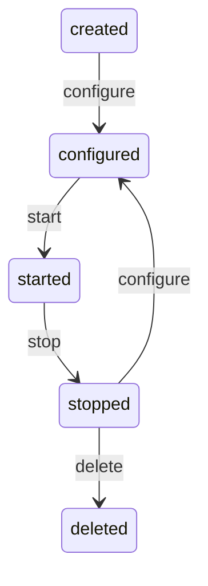

# Node Lifecycle and Interface

This document defines a single, unified Node lifecycle and interface used across the server. All runtime-managed components (tools, triggers, providers, servers, agents, memory, etc.) implement the same lifecycle methods and semantics.

## Public Interface

TypeScript interface definition (method names and signatures are stable):

```ts
export interface Node<C = unknown> {
  // Apply configuration for the next start(). No side effects beyond config storage.
  configure(cfg: C): Promise<void>;

  // Activate the node using the most recently applied configuration.
  start(): Promise<void>;

  // Quiesce and release active resources.
  stop(): Promise<void>;

  // Irreversibly remove durable state/resources held by this node.
  delete(): Promise<void>;
}
```

Notes:
- Constructors are DI-only and must be side-effect free. All activation happens in `start()`.
- The lifecycle is explicit and uniform; orchestration calls only these four methods.

## States

- created: Instance constructed via DI but never configured.
- configured: Configuration is recorded and ready to be used by `start()`.
- started: Node is active and serving/processing.
- stopped: Node is inactive; no active resources.
- deleted: Node’s durable resources have been removed; the instance must not be reused.

## Idempotency Semantics

Each method MUST be idempotent. Repeating the same call in the same state is a no-op and MUST resolve successfully. Explicit semantics:

- configure(cfg)
  - Allowed in states: created, configured, stopped.
  - Effect: Persist/record `cfg` to be applied on the next `start()`; do not activate.
  - Idempotent: Re-applying an equivalent `cfg` is a no-op. Re-applying a different `cfg` replaces prior config atomically.
  - Error: In started or deleted state. In started, callers must `stop()` first.

- start()
  - Allowed in state: configured only.
  - Effect: Acquire resources and begin processing using the most recent configuration.
  - Idempotent: Repeated `start()` calls while already started MUST be treated as a no-op if they occur; however, orchestrators should only use the transition defined in the diagram below.
  - Error: In created, stopped (must `configure()` first), or deleted state.

- stop()
  - Allowed in state: started.
  - Effect: Quiesce work and release all active resources. No durable state changes beyond what is necessary to stop cleanly.
  - Idempotent: Calling `stop()` again while stopped is a no-op.
  - Error: In created, configured, or deleted state.

- delete()
  - Allowed in state: stopped.
  - Effect: Irreversibly remove durable resources owned by this node. The instance is considered terminal after success.
  - Idempotent: Calling `delete()` multiple times succeeds; subsequent calls are no-ops.
  - Error: In created, configured, started (must `stop()` first), or deleted state (no-op allowed if treated idempotently by implementation).

## Allowed Calls per State and Expectations

The list below summarizes allowed calls. “No-op” means it MUST resolve successfully without changing state; “Error” means it MUST reject.

- created: configure=OK, start=Error, stop=Error, delete=Error
- configured: configure=OK (no-op if identical), start=OK, stop=Error, delete=Error
- started: configure=Error, start=No-op, stop=OK, delete=Error
- stopped: configure=OK, start=Error (must configure), stop=No-op, delete=OK
- deleted: All calls are Errors except `delete()` MAY be treated as No-op to satisfy idempotency

## State Diagram (Mermaid)

The runtime orchestrator uses exactly the following flows:



Flows represented:
- create → configure → start
- started → stop → configure → start
- started → stop → delete
