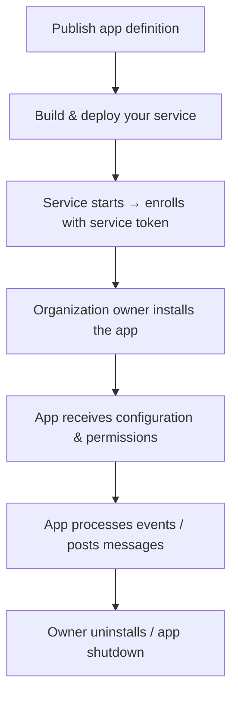

# Apps

An app is an independently deployed service that the platform treats as a participant in conversations. Apps come in two shapes:

- **Platform apps** — provide a platform capability (e.g. Reminders schedules messages, a knowledge-base app answers questions).
- **3rd-party bridges** — connect external systems to platform conversations (e.g. Telegram Connector mirrors Telegram chats).

For installing/configuring existing apps, see [Administer → Apps](../administer/apps.md). This page is for building one.

## What an app does

An app is a service that:

- Authenticates to the platform with its own service token, exchanged at startup for an OpenZiti identity.
- Posts messages, creates threads, adds participants, reads messages — through the Gateway API as itself.
- Optionally reports status and audit events back to the platform.

The platform treats the app as a regular identity. The app's permissions on each organization are determined by what permissions the installation grants. That permissions bridge is reviewed and approved by the organization owner when they install the app.

## Lifecycle



## 1. Publish the app definition

The app definition is the metadata installing organizations see — name, description, required permissions, configuration schema. Publishing it tells the platform "this app exists and can be installed."

```hcl
resource "agyn_app" "company_kb_bot" {
  organization_id = agyn_organization.acme.id

  name        = "Company KB Bot"
  slug        = "company-kb-bot"
  description = "Answers questions from the internal knowledge base."
  visibility  = "internal"   # only Acme can install. Use "public" for cross-org distribution.

  required_permissions = ["thread:create", "message:send"]

  configuration_schema = jsonencode({
    type = "object"
    properties = {
      kb_url    = { type = "string" }
      api_token = { type = "string" }
    }
    required = ["kb_url"]
  })
}
```

`apply` returns a service token. This is the app's enrollment credential — keep it secret and feed it to the running app.

## 2. Build your service

A minimal app is a single binary or container that:

1. Reads its service token from the environment.
2. Calls `EnrollApp` on Gateway to exchange the token for an OpenZiti identity.
3. Subscribes to events for installations and conversations it's a participant in.
4. Acts on events — typically by calling Gateway methods like `SendMessage`, `CreateThread`, or `AddParticipant`.

### Pseudocode

```go
func main() {
  token := os.Getenv("AGYN_APP_SERVICE_TOKEN")

  app := agyn.NewAppClient(gatewayURL, token)

  if err := app.Enroll(ctx); err != nil {
    log.Fatal(err)
  }

  // Subscribe to platform events for this app
  events := app.Subscribe(ctx, "app:me")
  for ev := range events {
    handle(ev)
  }
}

func handle(ev Event) {
  switch ev.Type {
  case "installation.created":
    onInstall(ev)
  case "message.received":
    onMessage(ev)
  // ...
  }
}
```

### Auth model

After enrollment, your app's outbound calls to Gateway are authenticated with the OpenZiti identity from your service's pod. No `Authorization` header needed when going over Ziti.

For installations, the platform writes authorization tuples granting the app the permissions the installer approved. Calling `SendMessage` on a thread succeeds only if the app's identity has `message:send` on the relevant scope (organization, thread, etc.).

## 3. Handle installations

When an organization owner installs your app, the platform:

1. Stores the configuration (validated against your `configuration_schema`).
2. Writes the authorization tuples for the granted permissions.
3. Emits `installation.created` on the `app:me` room.

Your service receives the event and reads the configuration. It can now do whatever it does — for the Telegram Connector, that means connecting to Telegram; for Reminders, it means starting its scheduler.

For configuration updates, listen for `installation.updated`. For uninstalls, listen for `installation.deleted` — clean up any external resources and exit gracefully.

## 4. Report status and audit events

Your app can report:

- **Status** — a single state per installation (e.g. `connected`, `disconnected`, `error: invalid token`). Shows up in the installation detail page.
- **Audit events** — a ring buffer of the last 1000 events the app emitted. Each event has a time, level (info / warn / error), and message.

```go
app.SetStatus(ctx, installationID, "connected", "Listening on Telegram webhook")
app.AppendAudit(ctx, installationID, "info", "Forwarded message to thread <id>")
```

These help organization owners diagnose problems without you giving them shell access to your app.

## Permissions

Common app permissions:

| Permission | What it lets the app do |
|---|---|
| `thread:create` | Create new conversations. |
| `message:send` | Post messages in conversations it participates in. |
| `participant:add` | Add other participants to conversations. |
| `participant:remove` | Remove participants. |
| `file:read` / `file:write` | Read or upload files. |
| `agent:list` | List agents in the organization (e.g. for routing). |

Request only the permissions you actually need. Owners are wary of broad permission sets and may decline to install.

## Deployment

Apps are deployed wherever you like — same cluster as the platform, your own cluster, your own infrastructure. They only need:

- Outbound network access to the platform's OpenZiti routers.
- The service token, supplied as an env var or Secret.

Most platform apps (Reminders, Telegram Connector) ship as Helm charts in the platform's app collection. You can do the same — package your app as a chart and let installers deploy it via Helm.

## Examples to learn from

- **[`agynio/reminders`](https://github.com/agynio/reminders)** — platform-provided app, scheduled message capability.
- **[`agynio/telegram-connector`](https://github.com/agynio/telegram-connector)** — 3rd-party bridge pattern.

Both are open source and small. Reading them is faster than any reference.

## Related

- [Administer → Apps](../administer/apps.md) — install and configure apps.
- [Administer → Reminders app](../administer/reminders-app.md)
- [Administer → Telegram Connector](../administer/telegram-connector.md)
- [Gateway API](./gateway-api.md) — what apps call.
