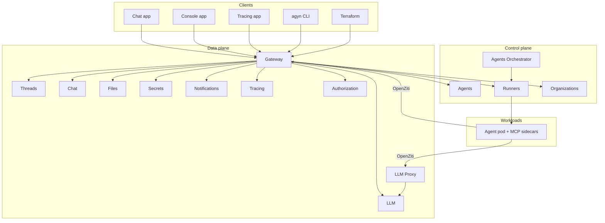

# Architecture at a glance

This is the customer-facing summary. For the full architecture, see [Operate → Architecture overview](../operate/architecture.md) and the [Reference service catalog](../reference/service-catalog.md).

## High-level diagram

## What each plane does

### Clients

The surfaces you interact with directly:

- **Chat app** — where users have conversations with agents.
- **Console app** — where admins configure organizations, agents, models, secrets, runners, and apps.
- **Tracing app** — where operators inspect runs, LLM calls, and tool output.
- **agyn CLI / Terraform** — for programmatic access and infrastructure-as-code.

### Control plane

Stores *desired state* — what should exist:

- **Agents** — agent definitions, plus their MCP servers, skills, hooks, environment variables, init scripts, and volume attachments.
- **Agents Orchestrator** — reconciler that ensures conversations with unacknowledged messages have running agent workloads.
- **Runners** — registry of where workloads can run (cluster-scoped or org-scoped) and the runtime state of each workload.
- **Organizations** — org lifecycle, membership, invites, and roles.

### Data plane

Serves runtime traffic — what actually happens during a conversation:

- **Gateway** — the single external API entry point. All clients (Chat, Console, CLI, Terraform, even agent workloads) talk to the platform through Gateway via ConnectRPC.
- **Threads** — generic conversation storage: messages, participants, acknowledgments.
- **Chat** — the chat product surface built on top of Threads.
- **Files** — file uploads, metadata, and pre-signed download URLs.
- **LLM** — provider and model registry. Resolves a platform model name (`gpt-4o`) to a provider endpoint, credential, and remote name.
- **LLM Proxy** — an OpenAI-compatible Responses API endpoint that agent workloads call. It authenticates the caller, resolves the model, and forwards to the upstream provider.
- **Secrets** — secret providers (Vault, local) and secret references.
- **Notifications** — real-time event fanout over WebSocket.
- **Tracing** — span ingestion and query, including full LLM call context.
- **Authorization** — a thin proxy in front of OpenFGA, the relationship-based access control engine.

### Workloads

Agent pods run on runners. Each pod contains:

- The **agent container** running the agent CLI (Codex, Claude Code, or our own `agn`).
- **`agynd`** — a wrapper daemon that bridges the agent CLI with the platform.
- **MCP server sidecars** — one per tool integration the agent uses.
- A **Ziti sidecar** for private network access to Gateway and LLM Proxy.

Agent pods reach Gateway and LLM Proxy over an OpenZiti overlay network. They do not have direct internet access by default — outbound traffic to LLM providers goes through LLM Proxy, which authenticates and meters the call.

## Data concerns

The platform separates three data lifetimes, each with its own storage:

| Concern | What it stores | Where | Lifetime |
|---|---|---|---|
| **Conversations** | Messages and participants | PostgreSQL (Threads) | Long-lived |
| **Agent state** | Working memory managed by the agent | Persistent volume | Lives as long as the volume |
| **Tracing** | Full LLM call context for observability | PostgreSQL (Tracing) | Shorter retention due to data volume |

Uploaded files live in S3-compatible object storage. OpenFGA holds authorization relationships, backed by PostgreSQL.

## Key flows

### A user sends a message

1. Chat app posts the message to Gateway → Threads.
2. Threads publishes a `message.created` event to Notifications.
3. Agents Orchestrator sees there are unacknowledged messages for the agent and starts a workload on an eligible runner.
4. The runner provisions the agent pod with its MCP sidecars and volumes.
5. `agynd` boots, pulls agent configuration from Agents, subscribes to thread events, and starts the agent CLI.
6. The agent reads the message, makes LLM calls through LLM Proxy, executes tools through MCP sidecars, and posts replies through Gateway → Threads.
7. Notifications fan messages and run events out to the chat UI and the Tracing app in real time.
8. When the agent is idle longer than the configured timeout, the orchestrator stops the workload.

### An admin creates a model

1. Admin clicks **New model** in the Console (or applies Terraform).
2. Console calls Gateway → LLM service.
3. LLM service writes the model record and bumps relevant authorization tuples.
4. Agents in the organization can now select this model in their configuration.

### An agent uses a tool

1. Agent CLI calls a tool over localhost (via the MCP sidecar exposed in the pod network).
2. The MCP server reaches the tool's backing system, possibly using injected secrets.
3. Tool output streams back through the agent and into the conversation transcript.
4. The Tracing app shows the tool call, input, output, and stdout/stderr in real time.

## Related

- [What is Agyn](./what-is-agyn.md)
- [Concepts](./concepts.md)
- [Operate → Architecture overview](../operate/architecture.md) — full architecture for operators.
- [Reference → Service catalog](../reference/service-catalog.md) — every service, its repo, and its responsibility.
