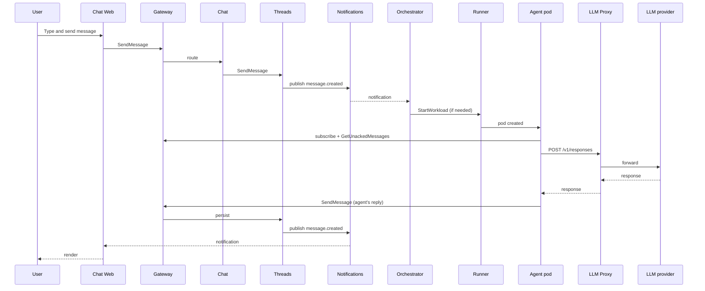

# Architecture overview

This is the operator's view. For the user-facing summary, see [Introduction → Architecture](../introduction/architecture.md).

## Planes

The platform splits into three planes:

| Plane | Purpose | Examples |
|---|---|---|
| **Control plane** | Stores desired state. Reconciles toward it. | Agents, Agents Orchestrator, Runners, Organizations. |
| **Data plane** | Serves runtime traffic. | Gateway, Threads, Chat, Files, LLM, LLM Proxy, Secrets, Notifications, Tracing, Authorization, Identity, Users, Apps Service, Media Proxy, Ziti Management, Token Counting, Metering. |
| **Workloads** | Agent pods provisioned on demand by the orchestrator. | Runtime container + agynd + MCP sidecars + Ziti sidecar. |

## Services

### Control plane

| Service | Responsibility |
|---|---|
| **Agents** | Stores agent definitions and sub-resources (MCPs, skills, hooks, ENVs, init scripts, volumes, attachments). Publishes `agent.updated` events when configuration changes. |
| **Agents Orchestrator** | Reconciler. Watches threads with unacked messages, selects an eligible runner, calls `StartWorkload`. Enforces idle timeout. Cleans up. Leader-elected via Kubernetes Lease. |
| **Runners** | Central registry of runners (cluster + org scopes) and runtime workload state. Reconciles container status via `InspectWorkload` calls to each runner. |
| **Organizations** | Org CRUD, membership lifecycle, invites. Owner of org-level authorization tuples. |

### Data plane

| Service | Responsibility |
|---|---|
| **Gateway** | Single external API. Speaks ConnectRPC, gRPC, gRPC-Web from one handler. Authenticates every request. |
| **Chat** | Built-in web/mobile chat experience. Wraps Threads with product behavior (unread counts, activity status). |
| **Threads** | Generic conversation storage. Type-agnostic participants. Publishes `message.created`. |
| **Files** | File upload, metadata, pre-signed URLs. S3-backed. |
| **LLM** | Provider + model registry. Resolves model name → provider endpoint + auth + remote name. |
| **LLM Proxy** | OpenAI-compatible Responses API (and Anthropic Messages API) for agents. Auth, resolve, forward, meter. |
| **Secrets** | Local secrets (encrypted at rest) and remote-provider secrets (Vault, etc.). Resolves on workload start. |
| **Notifications** | Real-time event fanout. Redis pub/sub backend. Socket.IO external, gRPC internal. |
| **Tracing** | OTLP span ingestion. Upsert semantics for in-progress spans. Per-LLM-call full context capture. |
| **Authorization** | Thin proxy in front of OpenFGA. Centralizes config, adds observability. |
| **Identity** | Central identity_id ↔ identity_type registry. Nickname uniqueness per org. |
| **Users** | User records, profiles, API tokens, devices. Provisions users on first OIDC login. |
| **Apps Service** | App definitions, installations, profiles, enrollment, audit log. |
| **Ziti Management** | All OpenZiti Controller interactions. Identity, service, policy CRUD. |
| **Metering** | Single store for usage records (LLM tokens, compute, storage, activity). Dedup by idempotency_key. |
| **Token Counting** | Provider-accurate tokenization for cost reporting. |
| **Media Proxy** | Authenticated media serving. SSRF protection. Image downsampling. Range requests for video/audio. |

### Workloads

Each agent pod contains:

- **Runtime container** — runs `agynd`, which runs the agent CLI.
- **MCP server sidecars** — one per MCP attached to the agent. Same pod network, accessed over localhost.
- **Hook sidecars** — one per hook configured.
- **Init container** — copies `agynd`, the agyn CLI, and the agent CLI binary into the runtime container.
- **Ziti sidecar** — provides OpenZiti tunnels for outbound calls to Gateway, LLM Proxy, and Tracing.

## Data stores

| Store | Used by | Notes |
|---|---|---|
| PostgreSQL | Threads, Users, Identity, Organizations, Agents, Runners, Tracing, Apps Service, Metering | Typical pattern: one Postgres cluster, one database per service. Tracing is the highest-volume database. |
| OpenFGA | Authorization | Backed by its own PostgreSQL database. |
| Redis | Notifications (pub/sub), short-lived caches | A single in-cluster or managed Redis is enough. |
| S3-compatible object storage | Files | One dedicated bucket. Lifecycle policies optional. |
| Persistent Volumes | Agent state (per-volume per-thread instances) | Each PVC is `ReadWriteOnce`. |

## Lifecycle: a user message ends up as agent output

## Internal vs. external authorization

- **External calls** (Gateway): OpenFGA-checked via the Authorization service.
- **Internal calls** (Istio mesh): Istio `AuthorizationPolicy` gates them by ServiceAccount. The Orchestrator and Runner services have privileged internal RPCs that bypass OpenFGA — exposed only to specific ServiceAccounts.

This separation is important: the data plane is callable by any authenticated identity (subject to authorization); the control plane has internal-only methods (e.g. `CreateWorkload` on Runners) that only the Orchestrator can call.

## Mixed responsibilities

A few services have both control- and data-plane responsibilities:

- **Runners** — registration (control) + workload state queries (data). The Console reads workload state for monitoring; the Orchestrator writes workload state for reconciliation.
- **Apps Service** — app definitions (control) + installation event delivery (data).

Both are flagged in their service docs.

## Repository map

| Repository | Contains |
|---|---|
| `agynio/api` | Protobuf schemas for all services. |
| `agynio/gateway` | Gateway service. |
| `agynio/threads` | Threads service. |
| `agynio/chat` | Chat service. |
| `agynio/agents` | Agents service. |
| `agynio/agents-orchestrator` | Reconciler. |
| `agynio/runners` | Runners service. |
| `agynio/organizations` | Organizations service. |
| `agynio/identity` | Identity registry. |
| `agynio/users` | Users service. |
| `agynio/files` | Files service. |
| `agynio/llm` | LLM service. |
| `agynio/llm-proxy` | LLM Proxy. |
| `agynio/secrets` | Secrets service. |
| `agynio/notifications` | Notifications service. |
| `agynio/tracing` | Tracing service. |
| `agynio/authorization` | Authorization service + OpenFGA model + Terraform. |
| `agynio/metering` | Metering service. |
| `agynio/token-counting` | Token counting service. |
| `agynio/media-proxy` | Media proxy. |
| `agynio/ziti-management` | Ziti Management service. |
| `agynio/apps` | Apps Service. |
| `agynio/k8s-runner` | Default Kubernetes runner. |
| `agynio/agynd-cli` | Agent wrapper daemon. |
| `agynio/agyn-cli` | Platform CLI. |
| `agynio/agn-cli` | Native agent loop. |
| `agynio/files-mcp` | Built-in file-access MCP. |
| `agynio/agent-init-{codex,claude,agn}` | Init images. |
| `agynio/console-app` | Console UI. |
| `agynio/chat-app` | Chat UI. |
| `agynio/tracing-app` | Tracing UI. |
| `agynio/reminders` | Reminders app. |
| `agynio/telegram-connector` | Telegram bridge app. |
| `agynio/terraform-provider-agyn` | Terraform provider. |
| `agynio/bootstrap` | Bootstrap — k3d + Terraform stacks. Source of install today. |
| `ghcr.io/agynio/charts/*` | Per-service Helm charts (OCI). Consumed by bootstrap today. |
| `agynio/platform-charts` | Centralized umbrella chart, in preparation. Will replace per-service deployment in bootstrap once stable. |

See [Reference → Service catalog](../reference/service-catalog.md) for a customer-facing version of the same list.

## Related

- [Networking](./networking.md)
- [Identity](./identity.md)
- [Authorization](./authorization.md)
- [Reference → Service catalog](../reference/service-catalog.md)
