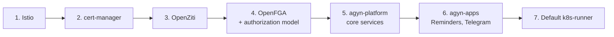

# Production install

Use this path for any environment that needs durable storage, real authentication, and operational guarantees. You bring your own Kubernetes, Istio, OpenZiti, OpenFGA, OIDC, Postgres, Redis, and S3. Agyn installs as a set of Helm charts from `agynio/platform-charts`.

## Before you start

1. Confirm you have the [production prerequisites](./prerequisites.md#for-the-production-install-path) ready.
2. Have your external dependencies operational and reachable from the cluster.
3. Prepare the required Kubernetes Secrets (DSNs, OIDC, S3, Ziti, OpenFGA). Names and keys are listed in the [Helm values reference](../reference/helm-values.md).

## Install order



Each step assumes the previous one is fully healthy before continuing.

## 1. Install Istio

Agyn services rely on Istio for in-cluster mTLS and `AuthorizationPolicy`-based internal RPC gating.

```sh
istioctl install --set profile=default
kubectl label namespace agyn istio-injection=enabled
```

The exact Istio profile and any custom `IstioOperator` overlay live in your operations repo. The minimum requirements: mesh-wide mTLS in `STRICT` mode, ingress gateway exposed to your load balancer.

## 2. Install cert-manager

```sh
helm repo add jetstack https://charts.jetstack.io
helm install cert-manager jetstack/cert-manager \
  --namespace cert-manager --create-namespace \
  --set installCRDs=true
```

Create a `ClusterIssuer` for your TLS provider. Agyn services use cert-manager-issued certificates for both ingress and internal cert rotation.

## 3. Install OpenZiti

Follow [OpenZiti's official deployment guide](https://openziti.io/docs/learn/quickstarts/network/) for installing a controller and at least one router in your cluster. Save the controller URL and an admin certificate — the Ziti Management service uses these.

Place the controller credentials in a Secret:

```sh
kubectl create secret generic agyn-platform-ziti \
  --namespace agyn \
  --from-literal=controller_url=https://ziti-controller.example.com:1280 \
  --from-file=client.crt=ziti-admin.crt \
  --from-file=client.key=ziti-admin.key
```

## 4. Install OpenFGA and apply the authorization model

Deploy OpenFGA with PostgreSQL persistence using the [official OpenFGA Helm chart](https://github.com/openfga/helm-charts). Then apply the Agyn authorization model:

```sh
git clone https://github.com/agynio/authorization.git
cd authorization
make apply-model FGA_API_URL=https://openfga.example.com
```

This creates the OpenFGA store and writes the authorization model the platform expects. Save the resulting store ID:

```sh
kubectl create secret generic agyn-platform-openfga \
  --namespace agyn \
  --from-literal=api_url=https://openfga.example.com \
  --from-literal=store_id=<store_id> \
  --from-literal=api_token=<token>
```

## 5. Install Agyn platform charts

```sh
helm repo add agyn https://charts.agyn.dev
helm install agyn-platform agyn/platform \
  --namespace agyn --create-namespace \
  --values values.yaml
```

A minimal `values.yaml`:

```yaml
global:
  domain: agyn.example.com
  tlsSecretName: agyn-tls

oidc:
  existingSecret: agyn-platform-oidc

postgres:
  existingSecret: agyn-platform-postgres

redis:
  existingSecret: agyn-platform-redis

s3:
  existingSecret: agyn-platform-s3

ziti:
  existingSecret: agyn-platform-ziti

openfga:
  existingSecret: agyn-platform-openfga

bootstrap:
  adminOidcSubject: <your OIDC subject>
  adminEmail: you@example.com
  adminName: Platform Admin
```

The `bootstrap.*` fields tell the chart to provision a synthetic admin identity, create an API token, and use it to bind your real admin user (identified by `adminOidcSubject`) as cluster admin. After the chart completes, the synthetic identity is no longer used.

The full list of values is in the [`platform-charts`](https://github.com/agynio/platform-charts) repo and summarized in [Reference → Helm values](../reference/helm-values.md).

## 6. Install platform apps (optional)

Reminders is installed by default with the platform chart. Telegram Connector and other apps install separately:

```sh
helm install agyn-telegram agyn/telegram-connector \
  --namespace agyn \
  --set telegram.botToken=<token>
```

See [Administer → Apps](../administer/apps.md) for app installation and configuration after deployment.

## 7. Register the default runner

The platform chart deploys a default in-cluster `k8s-runner`. Register it via the agyn CLI or Terraform:

```sh
agyn login --gateway https://gateway.agyn.example.com
agyn runners register --name in-cluster --scope cluster
```

The command prints a service token. Apply the token as a Kubernetes Secret in the runner's namespace so the runner can enroll at startup:

```sh
kubectl create secret generic k8s-runner-token \
  --namespace agyn \
  --from-literal=token=<service token>
```

The runner enrolls itself with OpenZiti on first start and shows up as `enrolled` in the Console under cluster runners.

## Verify

1. Open `https://console.agyn.example.com` and sign in with OIDC.
2. The Console should open in **Cluster Administration** context.
3. Under **Runners**, the default runner is `enrolled`.
4. Under **Users**, your account has `Cluster Admin = yes`.
5. Create a test organization, configure an LLM provider, register a model, create an agent, send a message. See [Administer](../administer/README.md).

## Next steps

- [First admin](./first-admin.md) — claim and verify your cluster admin role if not already bound.
- [Operate](../operate/README.md) — set up monitoring, backups, and upgrade procedures.
- [Administer](../administer/README.md) — create your first organization.

## Related

- [Prerequisites](./prerequisites.md)
- [Upgrades](./upgrades.md)
- [Operate → Architecture overview](../operate/architecture.md)
- [Operate → Backup & DR](../operate/backup-disaster-recovery.md)
- [Operate → Security](../operate/security.md)
