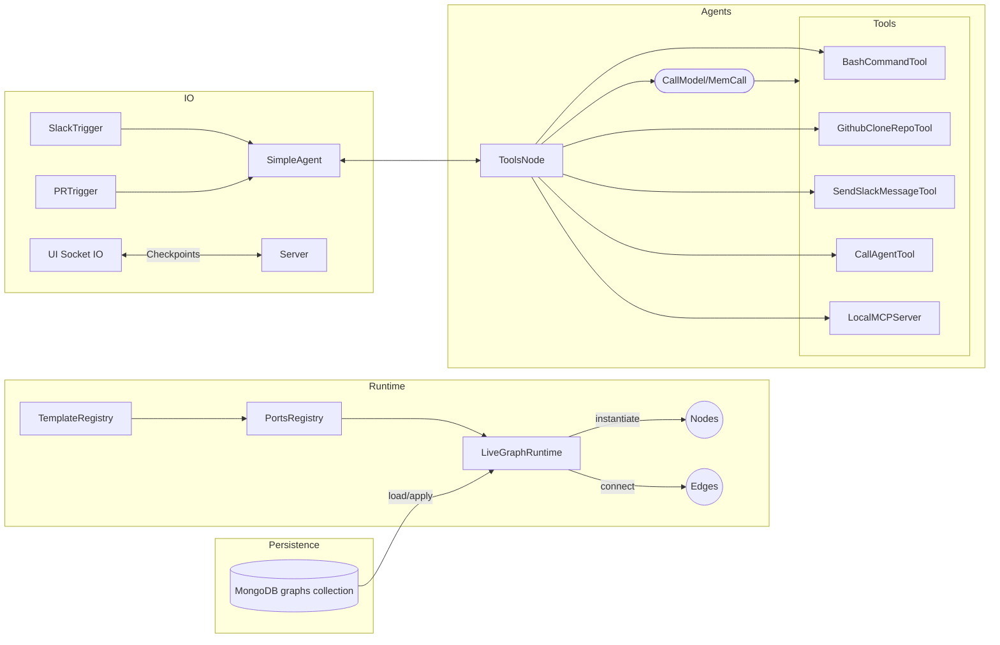

# Agents Technical Documentation

This document provides a comprehensive, developer-focused overview of the Agents repository. It describes the runtime model, graph-based architecture, key flows, configuration, and development practices so new contributors can quickly become effective.

Table of contents
- Project Overview
- High-Level Architecture
- File & Directory Organization
- Code Patterns & Conventions
- Unique Details & Domain Logic
- Key Flows
- Configuration & Dependencies
- How to Develop & Test
- Conversation summarization
- How to Extend & Contribute
- Security & Ops Notes
- Glossary

1. Project Overview
- Purpose: A TypeScript runtime and UI for building and operating graph-driven AI agents using LangGraph. The system composes Agents, Tools, Triggers, and external MCP servers into a live, reversible graph that can be updated at runtime.
- Primary use cases:
  - Operate agent graphs that react to external events (Slack messages, PR updates) and call tools (bash, GitHub, Slack) and MCP tools inside containers.
  - Persist graph definitions to MongoDB and apply diffs live without restarts.
  - Stream checkpoint writes to an interactive UI for observability.
- Pipeline phases:
  - Persisted graph fetch/validate -> Live graph apply (diff) -> Runtime execution (triggers -> agent graph -> tools) -> Checkpoint stream.
  - Parallelism: Graph diff/apply serializes graph mutations (to keep consistency), while operations inside nodes/tools (e.g., tool execution, network IO) run concurrently.
- Primary entry points:
  - Server bootstrap: apps/server/src/index.ts
  - Live graph runtime: apps/server/src/graph/liveGraph.manager.ts (class LiveGraphRuntime)
  - Template registry: apps/server/src/templates.ts (buildTemplateRegistry)
  - Triggers: apps/server/src/triggers
  - Tools: apps/server/src/tools
  - MCP: apps/server/src/mcp

2. High-Level Architecture
Design principles
- Idempotent, reversible graph edges: All connections are made via declared ports with create/destroy symmetry.
- Minimal global state: Nodes own their state; graph runtime orchestrates instantiation and connections.
- Live-updatable: Apply diffs to add/remove/update nodes and edges safely.
- Composition over reflection: Ports registry explicitly declares allowed connections to avoid brittle reflection.
- Container isolation per thread: Tools and MCP operations run in per-thread containers to isolate state.

Mermaid overview


Layers
- Application server (apps/server/src/index.ts): wires services, loads persisted graph, exposes minimal REST (templates/graph) and a Socket.IO stream for checkpoints.
- Graph runtime (apps/server/src/graph/*): live diff/apply engine (LiveGraphRuntime) enforcing reversible edges via PortsRegistry and TemplateRegistry wiring.
- Templates (apps/server/src/templates.ts): declarative registration of node factories and their ports.
- Triggers (apps/server/src/triggers/*): external event sources (Slack, PR polling) that push messages into agents.
- Nodes (apps/server/src/nodes/*): graph components like LLM invocation (CallModelNode, MemoryCallModelNode, ToolsNode).
- Tools (apps/server/src/tools/*): actions callable by the LLM (bash, GitHub clone, Slack message) and adapters.
- MCP (apps/server/src/mcp/*): LocalMCPServer and DockerExecTransport to expose MCP tools from a container as agent tools.
- Services (apps/server/src/services/*): infra clients and helpers (config, docker container provision, Mongo, Slack, GitHub, checkpointer, sockets).

Data and control flow
- Control: Triggers notify agents; agents run a LangGraph state machine that may call tools; the runtime manages which node instances exist and how they are connected.
- Data: Persisted graph (Mongo) -> GraphService validate/upsert -> LiveGraphRuntime apply -> Node instances with ports -> Executed edges recorded for reversal.

3. File & Directory Organization
Top-level
- apps/server: Server runtime and all backend code (agents, triggers, tools, MCP, services, graph runtime).
- apps/ui: React UI for graph building and checkpoint streaming.
- packages/shared: shared utilities (minimal for now).
- docs: technical docs and contributing guidelines.
- docker-compose.yml: local MongoDB with replica set.
- pnpm-workspace.yaml: monorepo configuration.

Key server paths
- apps/server/src/index.ts: bootstrap, REST endpoints, Socket.IO server, live graph application from persistence.
- apps/server/src/graph/*: core runtime types, PortsRegistry, TemplateRegistry, LiveGraphRuntime.
- apps/server/src/templates.ts: template registration and ports configuration.
- apps/server/src/triggers/*: SlackTrigger, PRTrigger, BaseTrigger.
- apps/server/src/nodes/*: BaseNode, CallModelNode, MemoryCallModelNode, ToolsNode.
- apps/server/src/tools/*: BaseTool + concrete tools (bash_command, github_clone_repo, send_slack_message).
- apps/server/src/mcp/*: LocalMCPServer and DockerExecTransport.
- apps/server/src/services/*: ConfigService, LoggerService, ContainerService, SlackService, GithubService, GraphService, CheckpointerService, SocketService.

4. Code Patterns & Conventions
- Layered composition via TemplateRegistry and PortsRegistry; explicit factory functions (FactoryFn) returning Configurable instances implementing setConfig.
- Reversible, idempotent edges: Ports are declared with kind: 'method' or 'instance'. Exactly one side must be method. Method ports specify create and optional destroy to reverse the edge.
- Logging: LoggerService with info/debug/error methods shared across services; errors are logged but non-fatal where recovery is acceptable.
- Validation: GraphService.validate ensures nodes/edges conform to TemplateRegistry schema before persistence.
- Concurrency: LiveGraphRuntime serializes apply() calls; inside an apply, node instantiation and edge execution are sequential to preserve ordering and reversibility semantics.
- Error handling: Graph errors are accumulated and surfaced in GraphDiffResult; apply continues where safe.
- Testing: Vitest used in server app; tests under apps/server/__tests__ exercise triggers and runtime.
- Formatting: Prettier config (.prettierrc). Use TypeScript strictness suitable for runtime boundaries.

Internals notes
- Ports resolution: apps/server/src/graph/ports.registry.ts (PortsRegistry.resolveEdge) enforces “exactly one method side” and computes callableSide and the argument (the other instance).
- Graph diff: apps/server/src/graph/liveGraph.manager.ts
  - computeDiff(prev,next) identifies added/removed/recreated nodes, config updates, and edge adds/removes via edgeKey serialization.
  - _applyGraphInternal applies in order: create/recreate nodes -> set config -> remove edges (reverse) -> remove nodes -> add edges -> bump version, record lastGraph.
- Lifecycle: All graph participants may implement destroy() which the runtime calls on disposal.
- Tools adapter: Tools are initialized per action via BaseTool.init(config) producing a DynamicStructuredTool that can read thread_id from LangGraph config.configurable.

5. Unique Details & Domain Logic
Live reversible graph via ports
- Ports model: sourcePorts and targetPorts per template; method ports declare create/destroy methods; instance ports denote passing self.
- Execution rule: The runtime invokes create on the method side, passing the opposite instance. Reversal calls destroy with the same argument.
- Validation: Both-method and neither-method edges are rejected. Instance method presence is checked at registration time (PortsRegistry.validateTemplateInstance can be used by factories).

Graph diff algorithm (simplified)
- Nodes:
  - Added: present in next not in prev -> instantiate via factory, then optional setConfig.
  - Recreated: template changed -> dispose old (reverse edges, teardown lifecycle, purge maps), then instantiate fresh.
  - Config change: setConfig called on live instance.
  - Removed: dispose (reverse residual edges, teardown lifecycle, purge maps).
- Edges:
  - Removed first: reverse if recorded in executedEdges, unregister record.
  - Added: resolve callable/instance sides via ports and invoke create(); register ExecutedEdgeRecord with reversal closure.

MCP integration
- Transport (DockerExecTransport): Attaches to docker exec stdio, demuxes, line-delimited JSON-RPC messages, implements start/send/close with onmessage/onerror/onclose callbacks.
- Server (LocalMCPServer):
  - discoverTools(): uses a temporary container to start MCP process and list tools once; caches tools.
  - start(): resilient start intent with dependency polling and exponential backoff; emits 'ready' once tools are discovered.
  - callTool(name,args,{threadId}): ephemeral exec per call in the thread’s container; flattens content array to text and returns structuredContent/raw.
  - container per thread: using ContainerProviderEntity.provide(threadId) to isolate tool state.

Triggers
- SlackTrigger: Socket Mode listener that forwards user messages as TriggerMessage with thread computed from user and Slack thread_ts.
- PRTrigger: Polls GitHub for PRs where the authenticated user is assignee (optionally include authored). Computes a composite md5 over updated_at, checks, events, and mergeability to detect changes; emits per-PR thread messages.

Fault tolerance and correctness
- Edge reversal during node disposal is best-effort; failures are logged and ignored to ensure forward progress.
- MCP start retries limited by restart.maxAttempts (default 5) with exponential backoff; dependency wait timeout 30s surfaces an error.
- Tools should validate inputs with zod and bound execution (timeouts, output size limits).

Before vs After example: reversible edge
- Before (added edge): create(source.method, target.instance)
- After (removed edge): destroy(source.method, target.instance)

```ts
// Before: add edge agent.tools -> bashTool.$self
await agent.addTool(bashTool);
// After: remove edge => reverse
await agent.removeTool(bashTool);
```

6. Key Flows
A. Persisted graph lifecycle
1) Server starts (apps/server/src/index.ts) and connects to MongoDB. GraphService loads persisted graph 'main'.
2) LiveGraphRuntime.apply(toRuntimeGraph(persisted)) computes diff vs lastGraph and performs ordered updates.
3) Nodes are instantiated via TemplateRegistry factories; edges are executed via PortsRegistry rules.
4) Subsequent POST /api/graph upserts a new graph version (optimistic lock); the server applies it live.

B. Tool execution from LLM
1) SimpleAgent produces an AIMessage with tool_calls (via CallModelNode or MemoryCallModelNode).
2) ToolsNode inspects AIMessage.tool_calls and invokes matching DynamicStructuredTool instances from registered BaseTool instances.
3) Tools can read config.configurable.thread_id for per-thread isolation; container-backed tools fetch per-thread container and execute.
4) Tool results are returned as ToolMessage(s) and appended to the conversation state.

C. MCP tool call
1) At wiring time, simpleAgent.mcp -> mcpServer.register triggers LocalMCPServer.start() and discoverTools(); agent registers namespaced tools.
2) On tool call, LocalMCPServer.callTool(name,args,{threadId}) launches docker exec in the thread’s container and performs JSON-RPC call.
3) Output content array is flattened to text; structuredContent is kept in result.

7. Configuration & Dependencies
Environment variables (server)
- GITHUB_APP_ID: GitHub App ID (required)
- GITHUB_APP_PRIVATE_KEY: PEM contents (required)
- GITHUB_INSTALLATION_ID: Installation ID (required)
- OPENAI_API_KEY: OpenAI API key (required)
- GH_TOKEN: Personal access token for GitHub (required for some personal-scoped operations)
- SLACK_BOT_TOKEN: Slack bot token (required if using Slack)
- SLACK_APP_TOKEN: Slack app-level token (required for Socket Mode)
- MONGODB_URL: MongoDB connection string (replica set required for change streams)

External services
- MongoDB replica set: required for checkpoint change streams. docker-compose.yml runs a single-node replica set locally.
- Docker: required for containerized tools and MCP servers.
- OpenAI: for ChatOpenAI LLM usage in nodes.
- Slack and GitHub APIs: for triggers and tools.

Important config files
- apps/server/src/services/config.service.ts: config schema and env mapping.
- docker-compose.yml: local Mongo replica set bootstrap.

Defaults and toggles
- LiveGraphRuntime serializes apply operations by default.
- PRTrigger intervalMs default 60000; includeAuthored default false.
- MCP restart defaults: maxAttempts 5; backoffMs 2000.

8. How to Develop & Test
Prereqs
- Node.js 20+
- pnpm 9+
- Docker (for container tools and MCP)
- MongoDB (or use Docker Compose)

Setup
- Copy env and set values
  - cp apps/server/.env.example .env
  - Ensure MONGODB_URL points to a replica set, e.g., mongodb://localhost:27017/?replicaSet=rs0
- Start Mongo locally:
  - docker compose up -d mongo
  - Verify: docker compose exec mongo mongosh --eval 'rs.status().ok' -> 1

Run server
- pnpm --filter server dev
- The server listens on :3010 and exposes:
  - GET /api/templates
  - GET /api/graph
  - POST /api/graph (upsert and apply)
- Socket.IO streams checkpoint writes after client emits 'init'.

Run UI
- pnpm --filter ui dev
- Open the printed URL; UI will stream checkpoint events.

Tests
- Server tests: pnpm --filter server test

Conversation summarization
- Rolling summary keeps older history compressed and last K verbatim; controlled by summarizationKeepLast and summarizationMaxTokens.
- SimpleAgent state includes summary (default '').
- SummarizationNode runs before each model call and may update summary and prune messages.
- CallModelNode uses buildContextForModel to create [System(systemPrompt), System(summary)?, ...last K] trimmed to maxTokens.
- See docs/summarization.md for details and examples.

Debugging tips
- Set LoggerService to print debug logs; inspect global liveGraphRuntime from a debugger if needed.
- For MCP issues, confirm Docker is running and the container image has required tools and network.
- If change streams do not emit, verify Mongo is a replica set and MONGODB_URL includes ?replicaSet=rs0.

Extending parser/linker/printer analogs
- Add new templates by registering in apps/server/src/templates.ts with explicit ports.
- Avoid reflection-based edge wiring; declare ports and method names explicitly for reversibility.
- Use zod schemas in tools for input validation.

9. How to Extend & Contribute
- Extension points:
  - New tools (apps/server/src/tools/*) implementing BaseTool and registered as a template with a containerProvider port if needed.
  - New triggers (apps/server/src/triggers/*) extending BaseTrigger and registered in templates.
  - New nodes (apps/server/src/nodes/*) for LLM strategies or middleware.
- Coding standards: TypeScript, Prettier; small, composable units; keep ports reversible.
- Commits: Conventional style preferred (feat:, fix:, docs:, refactor:, test:).
- Branching/PR: Create a short-lived branch per change; add tests where feasible.
- See also: docs/contributing/index.md and docs/contributing/style_guides.md.

10. Security & Ops Notes
- Secrets: Never commit tokens; load via environment variables. Container env is explicit via ContainerProviderEntity config.
- AuthN/Z: GitHub App + PAT; Slack Socket Mode tokens required. Limit scopes to least privilege.
- CI/CD: Not covered here; tests run with Vitest. Add CI to run lint/test.
- Observability: LoggerService and Socket.IO checkpoint stream; add metrics for MCP as needed.

Glossary
- TemplateRegistry: Registry mapping template name -> factory (returns Configurable instance) and ports for wiring.
- PortsRegistry: Declarative mapping of source/target handles and their kinds (method vs instance); enforces reversible edges.
- LiveGraphRuntime: Applies diffs from a GraphDefinition to live instances, maintaining executed edge records for reversal.
- ExecutedEdgeRecord: Runtime record of an executed edge with a reversal closure.
- Trigger: External event source feeding agent threads.
- Tool: Action callable by LLM tool calls; implemented as BaseTool returning DynamicStructuredTool.
- MCP: Model Context Protocol; a tool discovery and invocation protocol over stdio or sockets.
- ContainerProviderEntity: A provider that ensures a per-thread Docker container with persistent labels.
