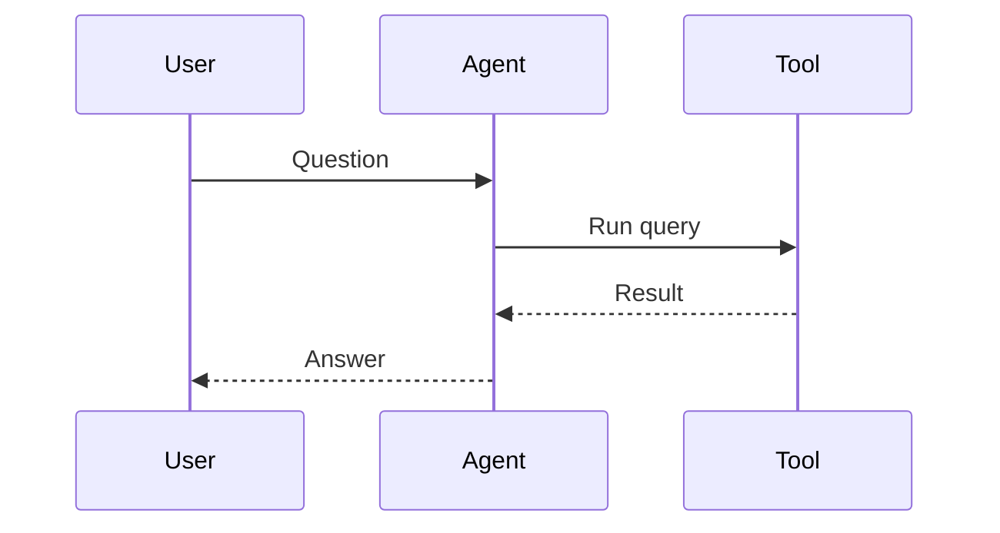

# Charts and diagrams

Agents can render charts and diagrams inline by posting fenced code blocks in two languages: `vega-lite` for charts and `mermaid` for diagrams. These render as SVG inside the message, sized to the message column.

## What charts look like

Agents post a fenced code block:

````
```vega-lite
{
  "data": { "values": [
    { "month": "Jan", "sales": 120 },
    { "month": "Feb", "sales": 200 },
    { "month": "Mar", "sales": 150 }
  ]},
  "mark": "bar",
  "encoding": {
    "x": { "field": "month", "type": "nominal" },
    "y": { "field": "sales", "type": "quantitative" }
  }
}
```
````

The Chat app turns this into a bar chart. Vega-Lite supports bar, line, scatter, histogram, area, and many other chart types — the [Vega-Lite documentation](https://vega.github.io/vega-lite/) has the full spec.

### Interaction

Vega-Lite charts are interactive:

- Hover for tooltips.
- Click legend items to toggle series.
- Pinch / scroll to pan and zoom (where the spec enables it).

## What diagrams look like

Agents post a Mermaid block:

````

````

This renders as a sequence diagram. Mermaid supports flowcharts, sequence diagrams, state diagrams, class diagrams, Gantt charts, and ER diagrams — see the [Mermaid documentation](https://mermaid.js.org/).

### Interaction

Mermaid diagrams are static SVG. You can:

- Select text inside the diagram (e.g. node labels).
- Scroll within the diagram if it overflows the message column.

There are no hover tooltips or click handlers.

## How rendering works

- **Fully client-side.** Both libraries run in your browser. The platform does not pre-render charts or diagrams.
- **No external data loading.** Vega-Lite specs that try to fetch from external `url` sources are rejected — only inline `values` are allowed. This prevents charts from leaking your viewing identity to third-party servers.
- **No remote fonts or images.** Both libraries fall back to local fonts.
- **No script execution.** SVG output is sanitized before insertion into the DOM.
- **Lazy library loading.** The Vega-Lite and Mermaid libraries load on demand the first time you open a message containing one. Until they load, the code block is shown verbatim.

## Invalid specs

If a chart or diagram cannot be parsed, the message shows a fallback with the original code and a short error message. The rest of the message still renders normally.

## Related

- [Chat](./chat.md)
- [Inline media](./inline-media.md)
